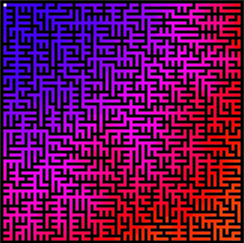
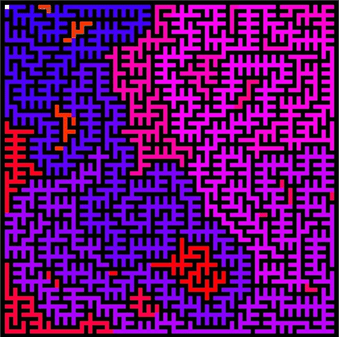
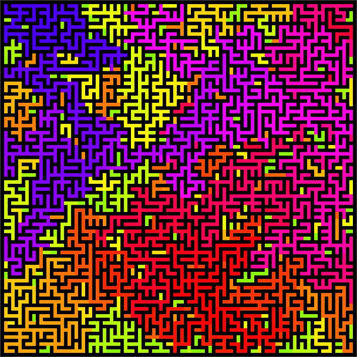

# FindIt

**Número da Lista**: X<br>
**Conteúdo da Disciplina**: Grafos1 e Grafos2<br>

## Alunos
|Matrícula | Aluno |
| -- | -- |
| 19/0026758  |  Deivid Alves de Carvalho  |
| 19/0030879  |  João Pedro Moura Oliveira |

## Sobre 
- O objetivo é construir um gerador de labirinto e um solucionar de labirinto seguido de uma interface.
- O gerador de labirinto é criado utilizando a estrutura de um grafo com busca por uma DFS ou uma BFS. Quanto maior a profundidade do grafo, sua cor é alterada para melhor visualização da estrutura (Grafos 1).
- O solucionador faz uma busca por DFS ou BFS dentro da estrutura gerada buscando pelo nó de saída, quando achado é feito um backtrack até o inicio demonstrando o caminho feito pelo solucionador (Grafos 1).
- Também foram criados os geradores pela ideia de árvore geradora mínima (MST), pelos algorítmos de Prim e Kruskal. O algorítmo previamente feito de cores continuou sendo utilizado, permitindo uma melhor visualização da estrutura (Grafos 2).
- E por fim, um novo solucionador foi feito, o algorítmo A\* (A estrelha). Nesse algorítmo, utiliza-se a ideia de Dijkstra para encontrar o menor caminho de um ponto a outro, porém adapta-se o peso de acordo com heurísticas de distâncias calculadas a partir da distância de dois pontos em um plano cartesiano (Grafos 2).

## Screenshots
<details>
<summary>Grafos 1</summary>

### Gerando labirintos (dfs e bfs)
<p>
    
    
</p>

### Resolvendo labirintos (dfs em uma bfs e bfs em uma dfs)
<p>
    
    
</p>
</details>

<details>
<summary open> Grafos 2</summary>

### Gerando labirintos (Prim e Kruskal)
<p>
    
    
</p>

### Resolvendo labirintos (A\* em um Prim)
<p>
    
</p>

</details>

## Instalação 
**Linguagem**: Python<br>
**Framework**: Pygame<br>
 
## Uso 
```bash
# Primeiro baixe o Pygame
$ pip install pygame

# Rode a main
$ python src/main.py
```
Após dar run na main.py, é necessário escolher a opção de gerador e solucionador do labirinto.
